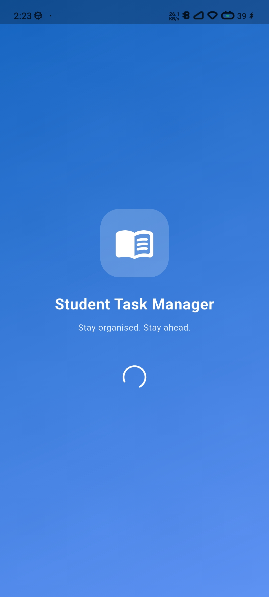
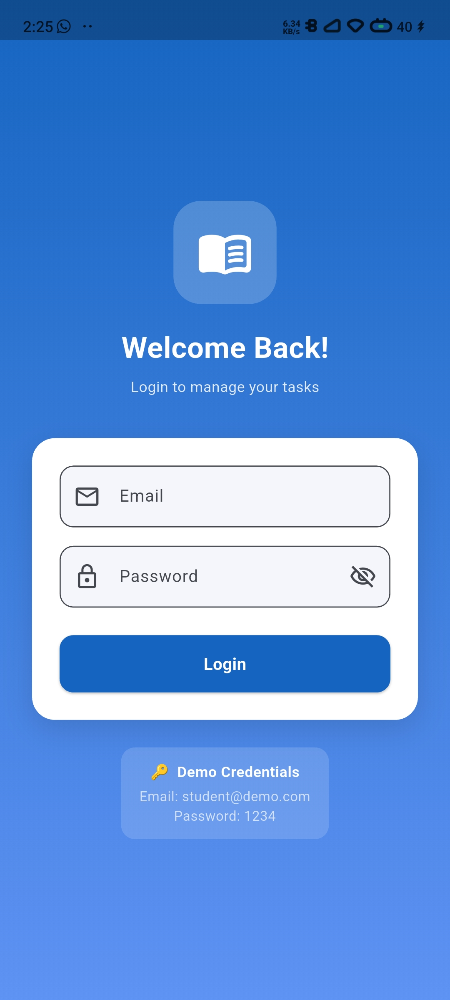
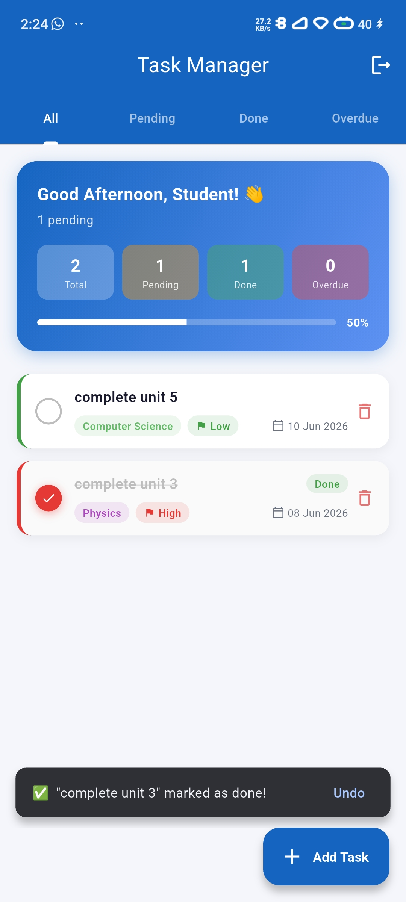
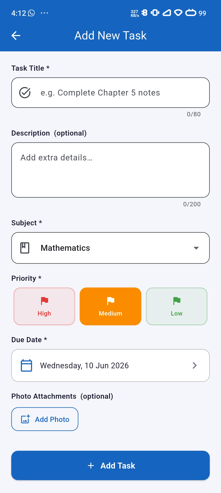

# Student Task Manager

A Flutter app  built to manage academic tasks — add tasks by subject, set priorities,
track due dates, and mark them done. Built with local storage so everything persists between sessions.

## Features

- Login screen with session persistence — stay logged in between launches
- Add tasks with subject, priority (High / Medium / Low), and due date
- Tap checkbox or swipe right to mark a task done — records completion timestamp
- Swipe left to delete with undo support 
- Attach photos from camera or gallery 
- Filter tabs — All, Pending, Done, Overdue 
- Dashboard with live stats and a completion progress bar 
- Session persistence — stays logged in between app launches

## Screenshots

Tech Stack
Flutter · Dart · SharedPreferences · image_picker

## Dependencies

shared_preferences: ^2.2.2   # persist tasks and login state
uuid: ^4.2.1                  # generate unique task IDs
intl: ^0.18.1                 # format due dates

## Project Structure

lib/
├── main.dart                 # App root, theme, splash screen
├── models/
│   └── task_model.dart       # Task data class, toJson/fromJson, helpers
├── pages/
│   ├── login_page.dart       # Login form with validation
│   ├── home_page.dart        # Dashboard, task list, filter tabs
│   └── add_task_page.dart    # Add and edit task form
├── widgets/
│   └── task_card.dart        # Animated task card with swipe gestures
└── utils/
    ├── constants.dart        # Colours, subject list, priority helpers
    └── task_service.dart     # All SharedPreferences CRUD operations

## Getting Started
git clone https://github.com/akanksha5362/student-task-manager.git
cd student-task-manager
flutter pub get
flutter run

Login with the demo account:

Email:    student@demo.com
Password: 1234

## What I'd Add Next

- [ ] Firebase auth so real accounts work
- [ ] Push notifications when a deadline is close
- [ ] Dark mode
- [ ] Search bar to filter tasks by keyword
- [ ] Sort options (by due date, priority, subject)

